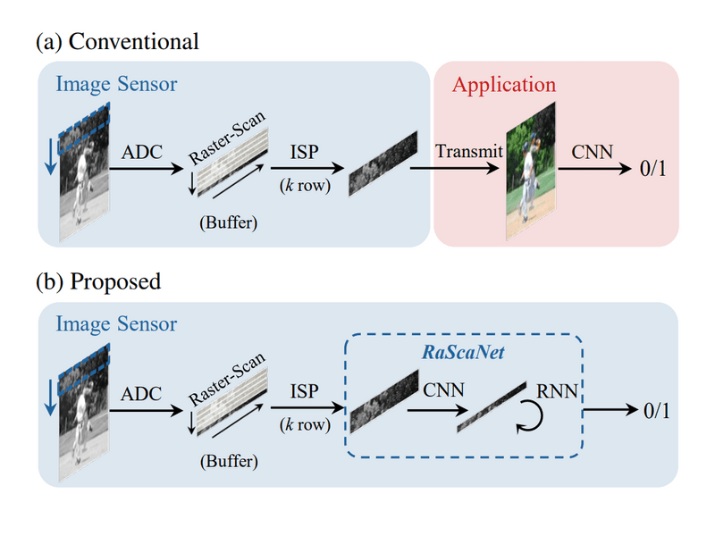

# RaScaNet: Learning Tiny Models by Raster-Scanning Images

Deploying deep convolutional neural networks on ultra-low power systems is challenging,
because the systems put a hard limit on the size of on-chip memory.
To overcome this drawback, we propose a novel Raster-Scanning Network, named RaScaNet,
inspired by raster-scanning in image sensors.

RaScaNet reads only a few rows of pixels at a time using a convolutional neural network
and then sequentially learns the representation of the whole image using
a recurrent neural network. The proposed method requires 15.9-24.3x smaller peak memory
and 5.3-12.9x smaller weight memory than the state-of-the-art tiny models.
The total memory usage of RaScaNet does not exceed 60 KB, in the VWW dataset with competitive accuracy.



- Conference: CVPR 2021
- [Paper](https://openaccess.thecvf.com/content/CVPR2021/papers/Yoo_RaScaNet_Learning_Tiny_Models_by_Raster-Scanning_Images_CVPR_2021_paper.pdf)
| [Video](https://youtu.be/MpVrKMD9ceo)
| [Citation](#citation)

## Requirements

- python 3.6
- torch 1.7.0
- torchvision 0.8.1
- pycocotools 2.0.1
- numpy 0.19.0
- [VWW dataset](https://github.com/Mxbonn/visualwakewords)

## Usage

For running the model, (only support vww dataset)

- `python test.py --dataset='vww' --dataset_path={dataset_path} --rsz_w=240 --model_path=checkpoint/rascanet_210x240.pth.tar`
- `python test.py --dataset='vww' --dataset_path={dataset_path} --rsz_w=120 --model_path=checkpoint/rascanet_105x120.pth.tar`

With early termination,

- `python test.py --dataset='vww' --dataset_path={dataset_path} --rsz_w=240 --model_path=checkpoint/rascanet_210x240.pth.tar --early_terminate=1`
- `python test.py --dataset='vww' --dataset_path={dataset_path} --rsz_w=120 --model_path=checkpoint/rascanet_105x120.pth.tar --early_terminate=1`

Currently, we do not provide the code for training.

## Result

|Model|Weight Memory|Peak Memory|OPs Cnt.|Accuracy|
|:---:|:-----------:|:---------:|:------:|:------:|
| rascanet(210x240) | 47.03 KB | 7.92 KB | 56.34 M | 91.835% |
| rascanet(105x120) | 31.77 KB | 3.60 KB | 9.71 M | 88.100% |

## Citation
```angular2
@InProceedings{Yoo_2021_CVPR,
    author    = {Yoo, Jaehyoung and Lee, Dongwook and Son, Changyong and Jung, Sangil and Yoo, ByungIn and Choi, Changkyu and Han, Jae-Joon and Han, Bohyung},
    title     = {RaScaNet: Learning Tiny Models by Raster-Scanning Images},
    booktitle = {Proceedings of the IEEE/CVF Conference on Computer Vision and Pattern Recognition (CVPR)},
    month     = {June},
    year      = {2021},
    pages     = {13673-13682}
}
```

## License
```
Copyright (C) 2021 Samsung Electronics Co. LTD

This software is a property of Samsung Electronics.
No part of this software, either material or conceptual may be copied or distributed, transmitted,
transcribed, stored in a retrieval system or translated into any human or computer language in any form by any means,
electronic, mechanical, manual or otherwise, or disclosed
to third parties without the express written permission of Samsung Electronics.
(Use of the Software is restricted to non-commercial, personal or academic, research purpose only)
```